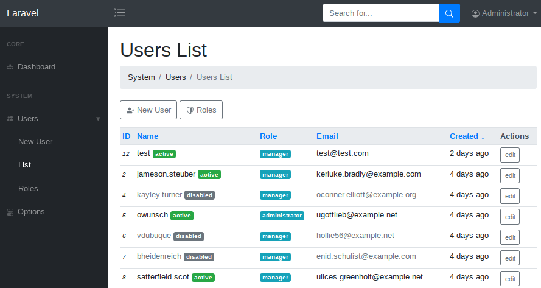

Laravel AdminPack
=================

This package provides an admin interface for your project.



Features:
- Admin user management.
- Admin user roles.
- Options.
- Blade components for building custom admin pages.
- Based on Bootstrap 4 css framework.

## Installation

```
composer require skoro/adminpack
artisan vendor:publish --provider=Skoro/AdminPack/AdminServiceProvider
artisan admin:init
```

You can access admin pages by route */admin*.
The default login credentials are: **administrator/admin**

## Configuration

By default url prefix for admin routes is *admin* but you can change it
to anything you like by editing the parameter *'path'* in the `config/admin.php`.

## Artisan commands

- `admin:init` - initialization, fills the admin tables by default values.
- `option:list`, `option:get`, `option:set`, `option:delete` - manages admin options.
